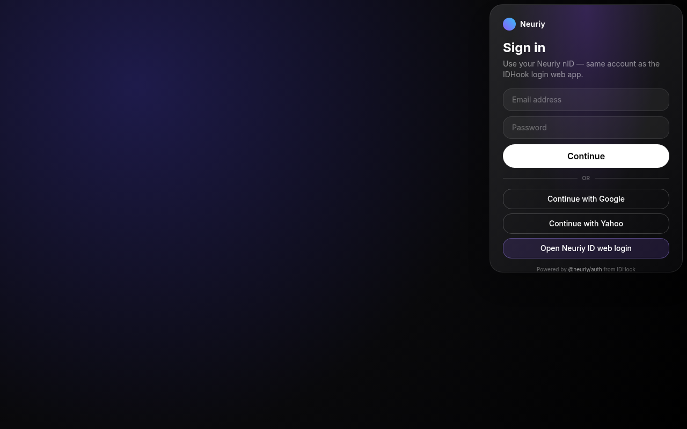
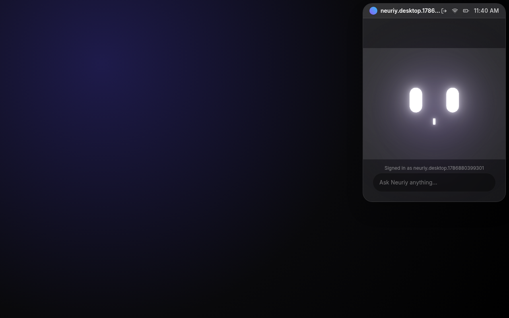

# Neuriy Desktop

Tray-resident AI assistant panel for macOS / Windows / Linux. Frontend auth is powered by the **[@neuriy/auth](https://github.com/neuriy/IDHook)** SDK — the same kit behind the Neuriy nID login web app.

## How it works

```text
┌─────────────────────┐     @neuriy/auth SDK      ┌──────────────────────────┐
│  Neuriy Desktop UI  │ ─────────────────────────▶│  Firebase Auth (shared)  │
│  LoginPanel / App   │◀──── session (user) ──────│  robbieart-com project   │
└─────────────────────┘                           └────────────▲─────────────┘
         │                                                     │
         │  “Open Neuriy ID web login”                         │
         ▼                                                     │
┌─────────────────────┐                                        │
│  IDHook web app     │────────────────────────────────────────┘
│  /auth/login        │   same Google / Yahoo / email accounts
│  github.com/neuriy/IDHook
└─────────────────────┘
```

1. App boots and calls `initNeuriyAuth()` with the IDHook Firebase project.
2. `NeuriyAuthProvider` + `NeuriyAuthGuard` gate the panel:
   - **Signed out** → `LoginPanel` (email, Google, Yahoo, or open web login)
   - **Signed in** → `DesktopPanel` (Face AI + chat input) with profile in the top bar
3. Email / Google / Yahoo go through `@neuriy/auth` (same APIs as the web app).
4. **Open Neuriy ID web login** launches the hosted IDHook page (`VITE_NID_LOGIN_URL`, default `https://id.neuriy.com`) via Electron `shell.openExternal`.

### Demo screenshots

| Login (SDK) | Signed-in panel |
| --- | --- |
|  |  |

### Demo video

[Watch auth-flow.mp4](docs/demo/auth-flow.mp4) — email sign-in through `@neuriy/auth` into the Face AI panel (~9s).

<video src="docs/demo/auth-flow.mp4" controls width="640"></video>

## Quick start

```bash
npm install
npm run dev        # Electron + Vite
# or UI-only in the browser:
npm run dev:web
```

Open `http://localhost:5173` for browser mode. Electron shows the frameless tray panel.

## Auth setup

The SDK is vendored from [neuriy/IDHook](https://github.com/neuriy/IDHook) at `vendor/neuriy-auth` and linked as `@neuriy/auth`.

```ts
import { initNeuriyAuth, NeuriyAuthProvider, useNeuriyAuth } from '@neuriy/auth';
```

Optional overrides — copy `.env.example` → `.env.local`:

| Variable | Purpose |
| --- | --- |
| `VITE_FIREBASE_*` | Firebase web config (defaults match IDHook) |
| `VITE_NID_LOGIN_URL` | Hosted nID login base URL |

## Scripts

| Script | Description |
| --- | --- |
| `npm run dev` | Electron desktop + Vite HMR |
| `npm run dev:web` | Vite only (good for auth UI testing) |
| `npm run demo:capture` | Playwright screenshots + short auth video |
| `npm run typecheck` | TypeScript check (renderer + electron) |
| `npm run build` | Production Electron build |
| `npm run build:web` | Vite production bundle |

## Project layout

```text
src/
  App.tsx                 # NeuriyAuthProvider + auth guard
  lib/neuriy-auth.ts      # initNeuriyAuth + NID URL
  components/
    LoginPanel.tsx        # Email / Google / Yahoo / web login
    DesktopPanel.tsx      # Signed-in assistant UI
    TopBar.tsx            # Profile + sign out
vendor/neuriy-auth/       # @neuriy/auth SDK (from IDHook)
docs/demo/                # Screenshots + walkthrough video
```

## License

Private — Neuriy
