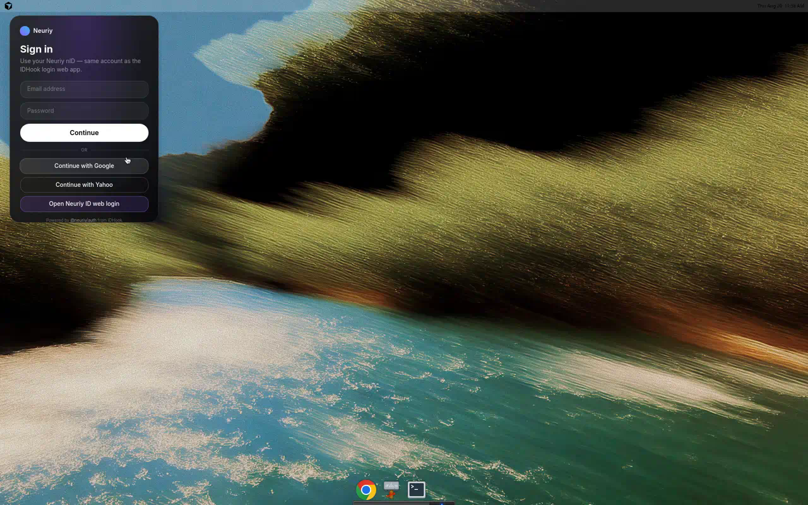
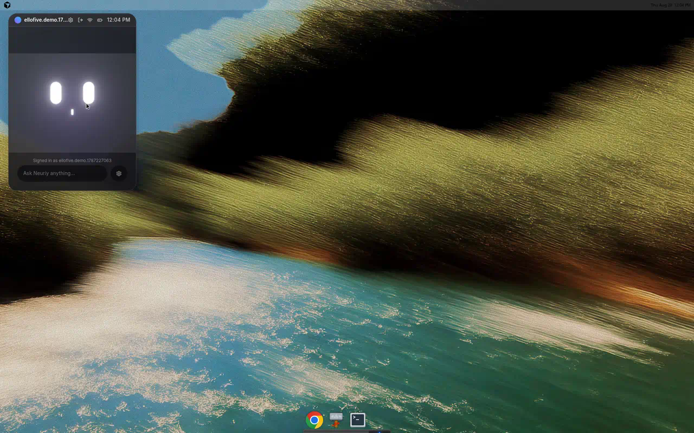
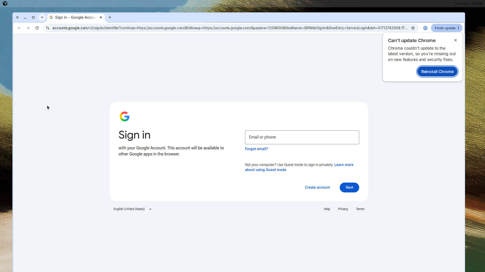

# Neuriy Desktop

Cross-platform tray / menu-bar AI assistant for **macOS**, **Windows**, and **Linux**.

- **Auth:** [@neuriy/auth](https://github.com/neuriy/IDHook) (Neuriy nID / Firebase)
- **Brain:** [ElloFive](https://github.com/EricksonAtHome/ElloFive) — your Ello5 coding AI (Ollama + `/v1/chat`)

The app runs in the background with a **native** system tray / menu-bar icon. Closing the popup does not quit the app.

## ElloFive AI

Neuriy’s “Ask …” box talks to **ElloFive** ([EricksonAtHome/ElloFive](https://github.com/EricksonAtHome/ElloFive)):

```text
Neuriy DesktopPanel  →  POST /v1/chat  →  ElloFive API  →  Ollama (ellofive model)
```

```bash
# On the machine running ElloFive:
ellofive serve          # Ollama runtime
ellofive api            # gateway on :3000  (Elloten UI + /v1/chat)

# Point Neuriy at it (.env.local):
VITE_ELLOFIVE_API_URL=http://127.0.0.1:3000
VITE_ELLOFIVE_MODEL=ellofive
```

Cloud hosts (when deployed): `api.ello5.com` — see ElloFive `docs/domains.md`.


## Cross-platform System Tray / Menu Bar

```text
SystemTrayService
        │
        ├── macOS  → NSStatusItem (menu bar next to Wi‑Fi / battery)
        ├── Windows → Notification area (system tray)
        └── Linux  → StatusNotifierItem / status area (GNOME*, KDE, XFCE, Cinnamon…)
```

\*GNOME typically needs an AppIndicator extension on stock GNOME Shell.

| Platform | Native surface | Primary click | Context menu |
| --- | --- | --- | --- |
| macOS | Menu bar (`LSUIElement` utility) | Toggle popover under icon | Right-click / Ctrl-click |
| Windows | Taskbar notification area | Open popup | Right-click |
| Linux | Desktop status area | Open popup | Right-click |

Shared tray menu (same actions everywhere):

```text
┌──────────────────────────┐
│ ✨ Neuriy                │
├──────────────────────────┤
│ Status: Online           │
│                          │
│ Open App                 │
│ Dashboard                │
│ Settings                 │
│ ☑ Notifications          │
│ ☑ Launch at Login        │
│ ───────────────────────  │
│ Quit                     │
└──────────────────────────┘
```

### Architecture

Application code talks only to `SystemTrayService` — no platform tray logic in the renderer or feature modules.

```text
electron/
  main.ts                         # lifecycle, single-instance, IPC
  tray/
    SystemTrayService.ts          # public API facade
    types.ts                      # TrayAdapter contract
    icons.ts                      # HiDPI / template icons
    adapters/
      createAdapter.ts            # OS detection → adapter
      macos.ts | windows.ts | linux.ts
  window/PanelWindow.ts           # frameless tray popover
  settings/store.ts               # launch-at-login + notification prefs
```

API surface:

```ts
SystemTrayService.initialize()
SystemTrayService.setIcon()
SystemTrayService.setTooltip()
SystemTrayService.show() / hide()
SystemTrayService.updateMenu()
SystemTrayService.showNotification()
SystemTrayService.openMainWindow()
SystemTrayService.quit()
```

Guarantees:

- Automatic OS detection and native tray host
- HiDPI / Retina tray icons (template image on macOS for light/dark menu bar)
- Single-instance lock (no duplicate tray icons)
- Tray survives when the popup is closed
- Launch at login via `app.setLoginItemSettings`
- Graceful icon cleanup on quit
- Not an HTML/CSS fake tray

## Auth (IDHook SDK)

```text
Desktop UI ── @neuriy/auth ── shared Firebase (IDHook nID)
                 │
                 └── optional “Open Neuriy ID web login”
```

### Demo

| Login | ElloFive signed-in (Firebase) | Google → system browser |
| --- | --- | --- |
|  |  |  |

**Videos**

- Full walkthrough: [neuriy-full-demo.mp4](docs/demo/neuriy-full-demo.mp4) — email login against Firebase Auth DB → Face AI → Google opens computer Chrome
- Email / Face AI only: [neuriy-ello-five-demo.mp4](docs/demo/neuriy-ello-five-demo.mp4)
- Google opens browser: [google-opens-browser.mp4](docs/demo/google-opens-browser.mp4)

Linux smoke test (tray): `docs/demo/linux-tray-panel.png`

**Continue with Google** opens the OS default browser via `shell.openExternal` (not an Electron popup).

## Quick start

```bash
npm install
npm run icons      # generate tray/app PNGs
npm run dev        # Electron + Vite (native tray)
npm run dev:web    # renderer only in the browser
```

## Packaging

Production installers include tray assets via `extraResources` and keep tray behavior outside the renderer.

```bash
npm run build:mac     # .dmg + .zip (.app) — x64 & arm64
npm run build:win     # NSIS .exe installer + portable
npm run build:linux   # AppImage + .deb + .rpm
npm run build         # host-platform targets
```

| Artifact | Command |
| --- | --- |
| macOS `.dmg` / `.app` (zip) | `build:mac` |
| Windows NSIS installer | `build:win` |
| Windows portable | `build:win` |
| Linux AppImage / deb / rpm | `build:linux` |

macOS builds set `LSUIElement` so Neuriy behaves as a menu-bar utility (no Dock icon).

## Scripts

| Script | Description |
| --- | --- |
| `npm run dev` | Electron + Vite with native tray |
| `npm run icons` | Regenerate `assets/tray` + `assets/icons` |
| `npm run typecheck` | Renderer + Electron TypeScript |
| `npm run build:mac` / `win` / `linux` | Platform packages |

## License

Private — Neuriy
